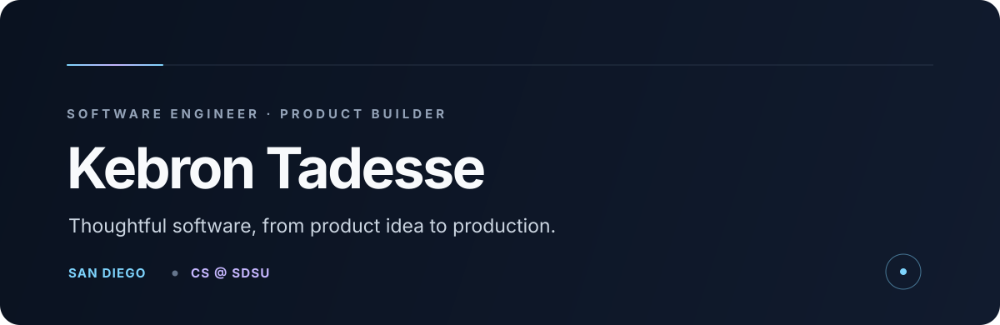
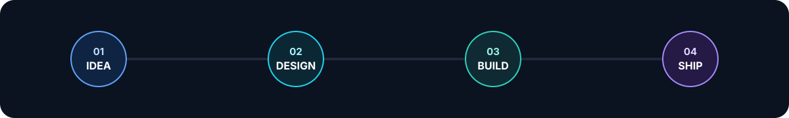

<div align="center"></div>

<br />

I turn ambitious product ideas into reliable software—across **web, backend, AI, and mobile**. I care about the whole journey: understanding the problem, shaping the experience, designing the system, and shipping something people can trust.

Currently studying **Computer Science at San Diego State University** and building production-minded products in San Diego.

<div align="center">
  <a href="https://orbitmodels.dev"></a>
  <a href="https://github.com/tenth-package0?tab=repositories"></a>
</div>

## What I'm building

| Project | What it does | Built with |
|:--|:--|:--|
| **[Orbit](https://github.com/tenth-package0/orbit)** · [Live ↗](https://orbitmodels.dev) | Benchmark-informed multi-model AI chat across GPT, Claude, and Gemini. | TypeScript · Next.js · AI APIs |
| **Worthy** | Production-oriented hiring infrastructure for growing teams—from jobs and candidate pipelines to assessments and interviews. | Next.js · Supabase · PostgreSQL |
| **[Kistane for iOS](https://github.com/tenth-package0/kistane-ios)** | Native language-preservation app with 9,924 trilingual dictionary records. | Swift · SwiftUI |
| **[Kistane for Flutter](https://github.com/tenth-package0/kistane-flutter)** | Cross-platform dictionary with multilingual search, quizzes, favorites, and cultural traditions. | Dart · Flutter |
| **[Mezgeb](https://github.com/tenth-package0/mezgeb)** | Offline-first photo and file vault with local encryption and Ethiopian calendar organization. | Flutter · Local-first architecture |

<div align="center"></div>

## Toolbox

<div align="center"></div>

## How I think

```text
Build for the user. Design for failure. Measure what matters. Keep shipping.
```

My engineering interests live at the intersection of **product engineering**, **applied AI infrastructure**, **backend reliability**, and software that serves real communities.

<div align="center"><sub>From an idea on a whiteboard to a system running in production.</sub></div>
